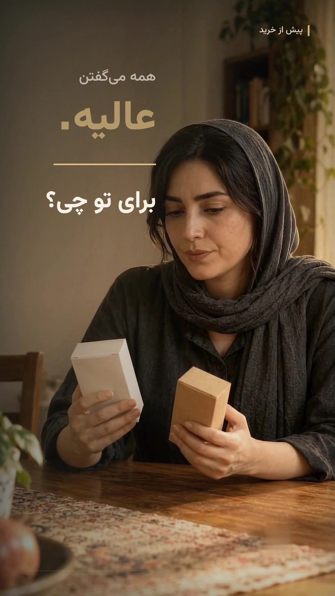

# قبل از اینکه بخری — ویدئوی تعاملی فارسی

یک فیلم عمودی تبلیغاتی با دو انتخاب تعاملی و پایان «نیاز به مشاوره دارم»؛ سپس فرم نام، موبایل و رضایت تماس. این مخزن، کد سایت و منابع قابل ویرایش ویدئو را نگهداری می‌کند. فایل ۱۰۸۰ اصلی و موسیقی خام WAV جداگانه در تحویل مالک قرار دارند.



## محتوا

- `site/`: سایت تعاملی RTL، فرم و migration پایگاه داده D1. فیلم 720×1280 در `site/public/assets/film.mp4` برای پخش وب قرار دارد.
- `media/hyperframes/`: تدوین، تایپوگرافی فارسی، ترنزیشن‌ها و فایل‌های تصویری محلی.
- `media/assets/`: چهار عکس ساخته‌شده، دو عنصر شفاف، موسیقی MP3، گویندگی Vibi و افکت‌های مجاز.
- `media/build_audio.py`: ساخت سه لایهٔ صوتی و میکس با ۲۸ جای افکت.
- `media/delivery/Master-plan-Audit.md`: ممیزی ۱۳ بند، شواهد و محدودیت‌ها.

## بازتولید فیلم

از ریشهٔ مخزن:

```bash
python3 -m pip install -r media/requirements.txt
python3 media/build_audio.py
cp media/audio/voice-master.wav media/audio/music-ducked.wav media/audio/sfx-mix.wav media/hyperframes/assets/
cd media/hyperframes
HYPERFRAMES_NO_TELEMETRY=1 DO_NOT_TRACK=1 npx --yes hyperframes@0.8.117 render --fps 60 --quality looks -o Before-You-Buy.mp4
```

FFmpeg و مرورگر پشتیبانی‌شده لازم‌اند. برای اجرا یا انتشار سایت، وابستگی‌های `site/package.json` و اتصال D1 با نام `DB` لازم است. مخزن پایگاه دادهٔ کاربران، اعتبارنامه‌ها یا تنظیمات خصوصی میزبان را شامل نمی‌شود.

این خروجی نسخهٔ بازبینی است. ممیزی تصویری نسخهٔ ۲ نتیجهٔ KEEP داد. شنیدن کامل و تأیید تلفظ و میکس صوتی در محیط تولید ممکن نبود؛ جزئیات در ممیزی مستر پلن آمده است. تصاویر صحنه‌ها ساختگی و تصویرسازی‌شده‌اند؛ نشان دیداری گوگل از نماهای پردازش‌شده حذف شده و فایل‌های اصلی Google Vids در پروژهٔ خصوصی منبع نگهداری می‌شوند.
